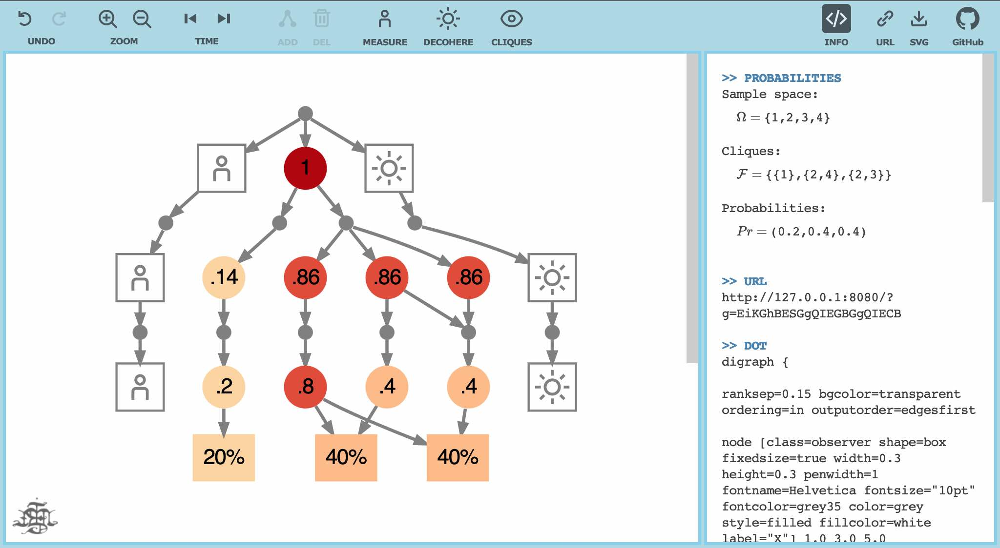
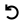
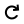
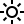
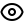
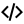
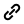
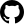

# Bipartite Graph QM

<br/>

**BigraphQM** is a web-based implementation of a graph-theoretic approach
to quantum mechanics.

In the current version, quantum systems can be modelled by manually building
[bipartite graphs](https://en.wikipedia.org/wiki/Bipartite_graph).
The method for calculating probabilities is based on finding maximal
[cliques](https://en.wikipedia.org/wiki/Clique_%28graph_theory%29)
by using a variant of the
[Bron-Kerbosch algorithm](https://en.wikipedia.org/wiki/Bron–Kerbosch_algorithm).

**Run it: https://met4citizen.github.io/BigraphQM/**

The app uses [d3-graphviz](https://github.com/magjac/d3-graphviz) and
[@hpcc-js/wasm](https://github.com/hpcc-systems/hpcc-js-wasm) for rendering
graphs and [MathJax](https://github.com/mathjax/MathJax) for displaying
LaTeX notation. The idea for the model, together with its interpretation,
is a spin-off of my earlier project
[Hypergraph](https://github.com/met4citizen/Hypergraph).


## Overview

In physical reality all the possible sequences of interactions happen.
Relative to each other, these sequences can be either consistent or
inconsistent. Only consistent (spacelike) sequences can interact.

In our model, sequences are thought of as maximal paths in a directed
[bipartite graphs](https://en.wikipedia.org/wiki/Bipartite_graph).
Whether two unique paths are consistent or not, depends on the ancestral
relations of their elements.

Consistency is a pairwise property. That is, if $A$ is consistent with both
$B$ and $C$, $B$ and $C$ don't have to be consistent with each other.
This gives the system many of its quantum mechanical properties.

Measurement is the process in which an observer interacts with
a spacelike system in a way that all these potential second-order
inconsistencies get resolved. The result is a set of mutually inconsistent
outcomes in each of which every pair is consistent. In graph theory, these
are called maximal
[cliques](https://en.wikipedia.org/wiki/Clique_%28graph_theory%29).

There are typically many sequences (permutations, ordered sets) that lead to
the same maximal clique
([image](https://en.wikipedia.org/wiki/Image_%28mathematics%29), unordered set).
From the observer's point of view, the proportion of all the sequences
that lead to each maximal clique is the probability of that outcome.


## The Model

Let $G$ be a directed
[bipartite graphs](https://en.wikipedia.org/wiki/Bipartite_graph) with parts
$V_{token}$ and $V_{event}$.

$\displaystyle\qquad G= (V_{token} \cup V_{event}, E),\quad E\subseteq (V_{token}{\times}V_{event})\cup (V_{event}{\times}V_{token})$

At each new step, the latest set of tokens $L_{token}$ is connected
to a new set of events that produces the next generation of tokens.

$\displaystyle\qquad L_{token}=\big\lbrace v \in V_{token}\mid\mathbf{deg^+} (v)=0 \big\rbrace$

Two tokens are spacelike, iff all their
[lowest common ancestors](https://en.wikipedia.org/wiki/Lowest_common_ancestor)
(LCA) are events. This means that the concept of space $S(X)\subset L_{token}$
is always relative to some observer $X\subset L_{token}$.

$\displaystyle\qquad S(X)=\big\lbrace v\in L_{token}\mid\forall a{\in} \mathbf{lca}(X,v){:}\: a \in V_{event}\big\rbrace$

Let the [sample space](https://en.wikipedia.org/wiki/Sample_space)
$\Omega$ be some subset of the space.

$\displaystyle\qquad\Omega\subseteq S(X)$

One way to find all the possible measurement outcomes $\mathcal{F}$ is to
first enumerate all the possible sequences of interactions and then take their
images. The problem is that the number of sequences grows factorially and
the algorithm has time complexity $O(n!)$.

Instead we can think of $\Omega$ as an undirected graph in which each token's
[neighbourhood](https://en.wikipedia.org/wiki/Neighbourhood_%28graph_theory%29)
$N(v)$ is the set of all spacelike tokens relative to that token.

$\displaystyle\qquad N(v) = S(v)\cap \Omega,\quad v\in\Omega$

The possible outcomes $\mathcal{F}$ are now this graph's maximal
[cliques](https://en.wikipedia.org/wiki/Clique_%28graph_theory%29).
The clique problem is NP-complete, but typically solvable within our sample
space sizes.

In the app we use a variant of the
[Bron-Kerbosch algorithm](https://en.wikipedia.org/wiki/Bron–Kerbosch_algorithm)
with the worst-case time complexity $O(3^{n\over 3})$ and for
[k-degenerate graphs](https://en.wikipedia.org/wiki/Degeneracy_%28graph_theory%29)
$O(kn3^\frac{k}{3})$.

$\displaystyle\qquad\mathcal{F} = \mathbf{BK}(\varnothing,\Omega,\varnothing)$

```
ALGORITHM BK(R, P, X) IS
    IF P and X are both empty THEN
        report R as a maximal clique
    choose a pivot vertex u in P ⋃ X
    FOR each vertex v in P \ N(u) DO
        BK(R ⋃ {v}, P ⋂ N(v), X ⋂ N(v))
        P := P \ {v}
        X := X ⋃ {v}
```

For each clique $\mathcal{F_1},\dots,\mathcal{F_m}$ there is a probability
$p_1,\dots,p_m$ that is the proportion of all consistent sequences of
interactions leading to that clique.

$\displaystyle\qquad p_j={{|\mathcal{F_j}|!}\over{\sum\limits_{k=1}^{m} |\mathcal{F_k}|!}},\quad j\in\{1,\dots,m\}$

The pure quantum state of each clique can be presented as a linear combination
of orthonormal vectors $|\phi_1\rangle,\dots,|\phi_n\rangle$ representing
tokens $v_1,\dots,v_n$ in $\Omega$. The square root left to the sum is the
[normalizing constant](https://en.wikipedia.org/wiki/Normalizing_constant).

$\displaystyle\qquad |\psi_j\rangle = \frac{1}{\sqrt{|\mathcal{F_j}|}}\sum_{i=1}^{n}\mathbf{1}_\mathcal{F_j}{(v_i)}|\phi_i\rangle$

The [density matrix](https://en.wikipedia.org/wiki/Density_matrix) $\rho$
is the weighted sum of the outer products of the pure states.

$\displaystyle\qquad \rho=\sum_{j=1}^{m} p_j|\psi_j\rangle\langle\psi_j|$

## Computational Basis

From the observer's point of view all the tokens are identical. It also means,
that they can't distinguish between two local cliques with the same numbers
of tokens. At measurement they can, however, distinguish the number of
interactions (i.e. energy), which is proportional to the size of the clique.

So, in order to create a two-state system that the observer can use for
computation, we can define a [qubit](https://en.wikipedia.org/wiki/Qubit)
so that $|0\rangle$ represents cliques of size one (ground state) and
$|1\rangle$ cliques of size two (first excited state). This scheme
generalises to d-state system i.e. qudits.


## The Editor

The bipartite graph on the app describes one possible set of consistent
sequences relative to the observer. It doesn't follow sequences that have
become inconsistent with the observer, because they can't interact with
each other.

To ensure consistency, **the editor only allows new edges between spacelike
elements**.

SYMBOL| DESCRIPTION
:-: | :--
<br/><sup>TOKEN</sup> | Tokens are abstract elements. The number inside the symbol $[0,1]$ represent the probability that the token will end up being part of some (any) classical state at (hypothetical) measurement.
<br/><sup>EVENT</sup> | Events use tokens as input and produce tokens as output.
<br/><sup>EDGE</sup> | Directed edges represent input/output relations between tokens and events. Only consistent (i.e. spacelike) connections are allowed.
<br/><sup>OBSERVER</sup> | Observer represents a classical system relative to which probabilities are calculated. The observer, too, is a bipartite subgraph, but instead of showing individual tokens and events, they are grouped together for simplicity.
<br/><sup>ENVIRONMENT</sup> | Environment is a classical system that can interfere with the sample space.
<br/><sup>CLIQUE</sup> | Maximal clique in probability space represents one possible classical outcome. The value inside the symbol is the probability for the observer to see that outcome at (hypothetical) measurement.

User Actions / Shortcuts:

- Click on a token/event to select it. Remove all the selections by clicking
on the background.
- Double click on a token/event to add a new branch.
- Drag a token/event on top of another event/token to connect the two with an
edge. Note: Only consistent (i.e. spacelike) connections are allowed.
- Drag a token to an empty space before or after another token to reorder the
tokens.
- Click on an edge to select it.
- Double click on an edge to delete it.

TOOL| DESCRIPTION
:-: | :--
<nobr></nobr><br/><sup>UNDO</sup> | Undo/redo operations. The maximum size of the undo buffer is 50 operations. The app also uses localStorage to store the current graph so that if you refresh the page without any URL parameters, you can restore the previous working model.
<nobr></nobr><br/><sup>ZOOM</sup> | Zoom the graph. If you want to increase/decrease the font size, zoom the browser window first and scale your graph to fit the screen using these zoom buttons.
<nobr></nobr><br/><sup>TIME</sup> | Decrease/increase time steps. When a new time step is added, new branches are added to the existing spacelike tokens. By decreasing the time steps you can go back all the way to the initial state.
<br/><sup>ADD</sup> | Add a new branch to the selected token/event. The new branch is automatically extended to the bottom of the graph.
<br/><sup>DEL</sup> | Delete the selected token/event/edge together with all its parents and children that are dependent on it.
<br/><sup>MEASURE</sup> | Shortcut for making a random proto-measurement.
<br/><sup>DECOHERE</sup> | Shortcut for adding random decoherence to the system.
<br/><sup>CLIQUES</sup> | Show a view with maximal cliques (classical states) and their probabilities. Note: While this view is shown the editing mode is disabled.
<br/><sup>INFO</sup> | Show the sidebar with details. The details include information about the selected tokens, probabilities, direct URL link to the graph, and the DOT source describing the shown graph. Refer to [The Model](#the-model) for an explanation of the presented mathematical concepts.
<br/><sup>URL</sup> | Copy URL to clipboard. Parameter `g` includes the Base64 encoded bipartite graph.
<br/><sup>SVG</sup> | Download the shown bipartite graph as a SVG file.
<br/><sup>GitHub</sup> | Link to the GitHub project.


## Gallery

MODEL| DESCRIPTION
:-: | :--
<nobr>**Wave function collapse**</nobr><br/><br/>[Open in App](https://met4citizen.github.io/BigraphQM/?g=GiKSGgQECBIGgQIECBGwQIECB)|All events are local by definition. However, new edges can add shortcuts through the graph's ancestral structure and break some existing spacelike relations. These instantaneous and non-local effects are known as the [wave function collapse](https://en.wikipedia.org/wiki/Wave_function_collapse).
<nobr>**Bell state (entanglement)**</nobr><br/><br/>[Open in App](https://met4citizen.github.io/BigraphQM/?g=DiIkSIkIQjQiEQjQDMGJAjQECIBAg)|[Bell state](https://en.wikipedia.org/wiki/Bell_state) is an example of a maximally [entangled state](https://en.wikipedia.org/wiki/Quantum_entanglement). Here we start with two sequences $A$ and $B$. They both split into two inconsistent (orthogonal) branches. Lets call them $\lvert\uparrow\rangle$ and $\lvert\downarrow\rangle$. These branches get entangled so that the observer can only see either $\lvert\uparrow\downarrow\rangle$ or $\lvert\downarrow\uparrow\rangle$ - never $\lvert\uparrow\uparrow\rangle$ or $\lvert\downarrow\downarrow\rangle$.
**Decoherence**<br/><br/>[Open in App](https://met4citizen.github.io/BigraphQM/?g=DiI8SSRHgISIkKDAjwEBAQEBAQ)|[Decoherence](https://en.wikipedia.org/wiki/Quantum_decoherence) is a process in which the system interacts with its environment so that the overlap decreases and the states become separable.
**Interference**<br/><br/>[Open in App](https://met4citizen.github.io/BigraphQM/?g=DiI8SSRHgCAigkCAjwBARAQRAR4AgIgIAgI8AQEQMAQEeAICMCAYCPAEBGBAEBHgICAgICAjwEBAQEBAQ)|Two spacelike parts of the sample space can interact and thus [interfere](https://en.wikipedia.org/wiki/Wave_interference) with each other. This changes the probabilities over time and disturbs the [probability wave](https://en.wikipedia.org/wiki/Wave_function). This can be seen at measurement as an interference pattern. - Note: The shown example is the result of random interactions.


## Notes and Acknowledgements

- The idea that every possible outcome is realised is based on
[Many-Worlds Interpretation](https://en.wikipedia.org/wiki/Many-worlds_interpretation).
- The terminology of consistent and inconsistent sequences is taken from
[Consistent Histories](https://en.wikipedia.org/wiki/Consistent_histories).
- The idea that all the facts/outcomes are relative comes from Carlo Rovelli's
[Relational Quantum Mechanics](https://en.wikipedia.org/wiki/Relational_quantum_mechanics).
- The graph-based approach is heavily influenced by the
[Wolfram Model](https://www.wolframphysics.org) and Max Piskunov's work on
Local Multiway Systems ([SetReplace](https://github.com/maxitg/SetReplace)).
- Several parts of the code are from my earlier project
[Hypergraph](https://github.com/met4citizen/Hypergraph).
- Many of the ideas were originally discussed with Tuomas Sorakivi.

----

## Appendix A: The Born Rule

The [Born rule](https://en.wikipedia.org/wiki/Born_rule) is often considered
a key postulate of quantum mechanics. It says that the absolute value of the
vectors inner product, or equivalently the cosine squared of the angle
between the lines the vectors span, corresponds to the transition probability.

The reason why the cosines are squared in the Born rule is geometric.
First, Kolmogorov's axioms tell us that the probabilities should add up to one.
Second, as shown below, the sum of cosines squared equals to one in
high dimensional vector spaces:

Let $r$ be the length of a hypervector in $n$ dimensional space.

$\displaystyle\qquad r =\sqrt{x_1^2+x_2^2+\dots+x_n^2} \qquad \Bigg| \cdot ()^2 \quad \Bigg| \cdot {1 \over {r^2}}$

$\displaystyle\qquad 1 = \left({{x_1} \over r}\right)^2+\left({{x_2} \over r}\right)^2 + \dots + \left({{x_n} \over r}\right)^2$

$\displaystyle\qquad 1 = cos^2 \theta_1 + cos^2 \theta_2 + \dots + cos^2 \theta_n \quad\square$

This works both ways. So, if we want to move from classical probabilities to
quantum probabilities - that is, from sets to vector spaces - we need to take
square roots to get the probability amplitudes.
